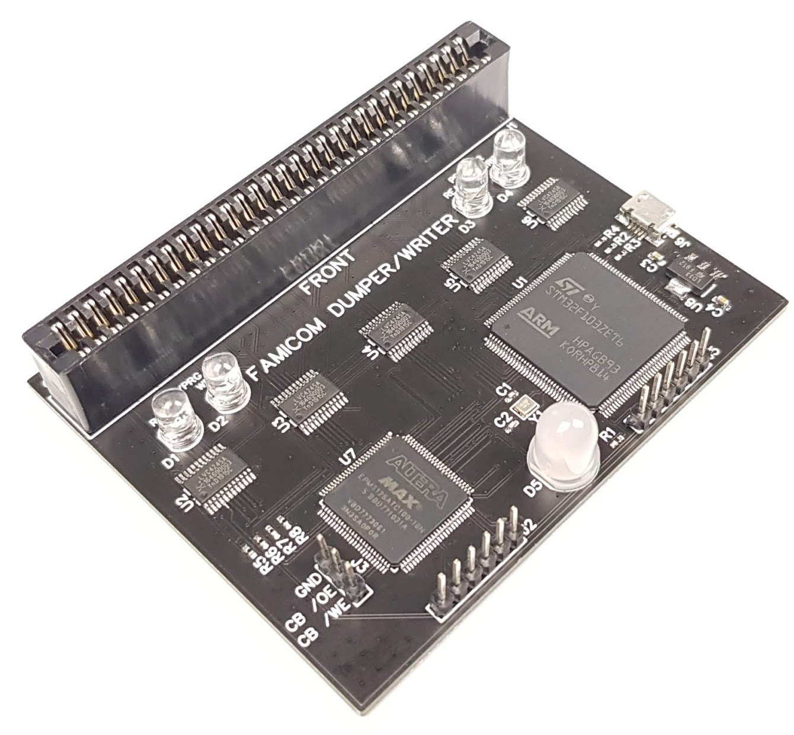
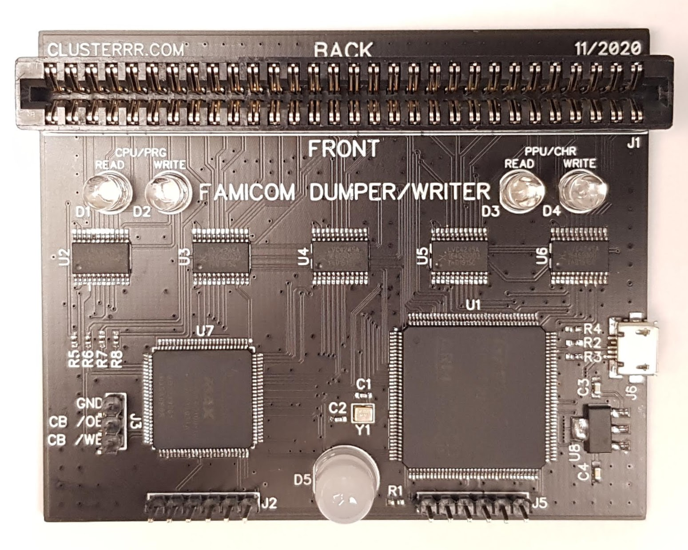
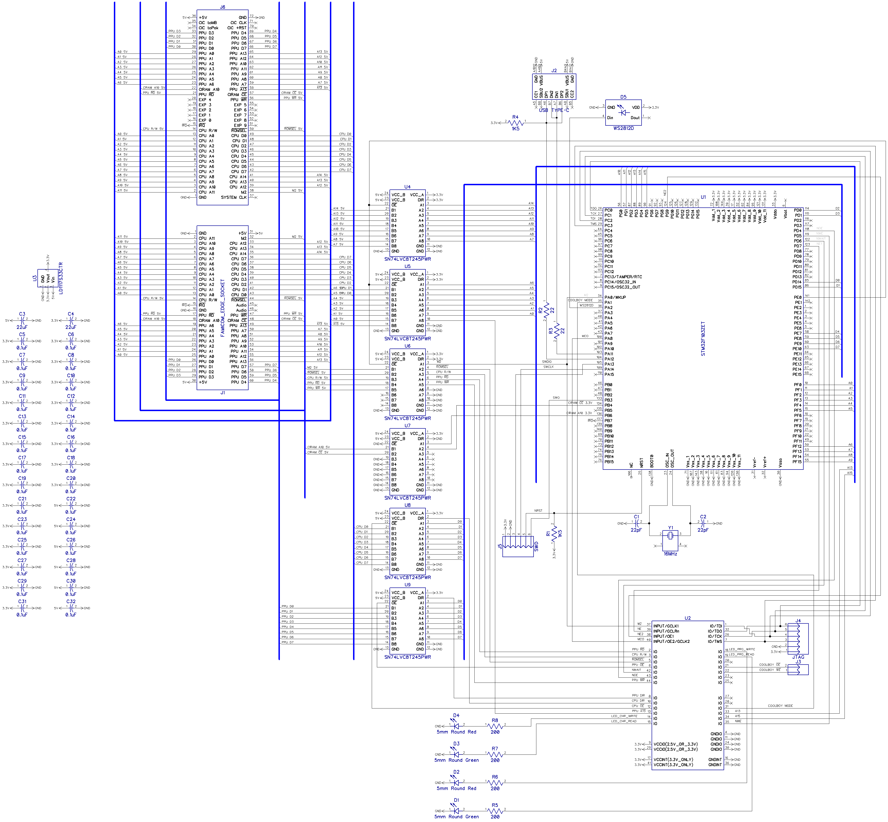
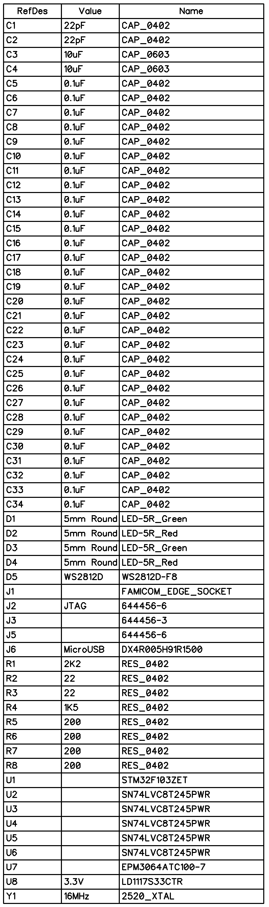

# Famicom Dumper/Writer

## Overview

This is a simple dumper/writer for Famicom cartridges and Famicom Disc System cards. This version is much faster compared to the [old one](https://github.com/ClusterM/famicom-dumper). It's using a very accurate M2 cycle simulation and FSMC (Flexible Static Memory Controller) to access PRG and CHR memory. FSMC is precisely synchronized with the M2 clock signal using a CPLD chip. The new version is also using a fast on-chip USB controller instead of a slow FT232 USB-UART converter.

You can use it to:

* Dump cartridges, so you can play copy of your cartridge on emulator.
* Read/write battery backed saves, so that you can continue your saved game on emulator/console.
* Write special cartridges like [COOLGIRL](https://github.com/ClusterM/coolgirl-famicom-multicard).
* Rewrite ultracheap chinese COOLBOY cartridges. Soldering is required to work with old versions but it's very simple. New versions can be rewritten without soldering.
* Test your cartridges.
* Read and frite Famicom Disk System cards using FDS drive with the RAM adapter.
* Some reverse engineering.
* Anything else that requires Famicom bus simulation.

## Schematic:

Bill of Materials:

## Firmware

You need to write firmware to two cips: the STM32 chip using ST-Link programmer and the EPM1270 CPLD chip using USB Blaster programmer.

## Software

[https://github.com/ClusterM/famicom-dumper-client](https://github.com/ClusterM/famicom-dumper-client)
