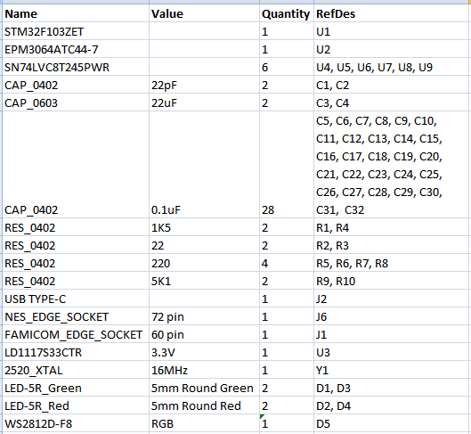

# Famicom/NES Dumper/Writer

## Overview

This is a powerfull dumper/writer for Famicom/NES cartridges and Famicom Disc System cards. The goal of the project is to create an ideal famicom data bus simulator. It's using a very accurate M2 cycle simulation and FSMC (Flexible Static Memory Controller) to access PRG and CHR memory. FSMC is precisely synchronized with the M2 clock signal using a CPLD chip. Also, this device is very fast.

Video about dumper development (English subtitles):

You can use it to:

* Dump cartridges, so you can play copy of your cartridge on emulator.
* Dump reset-based cartridges, there is command to simulate reset press.
* Dump cartridges that requires a continuous clock on M2 pin.
* Use it with [very flexible and multiplatform client](https://github.com/ClusterM/famicom-dumper-client), it's using C# scripts.
* Read/write battery backed saves, so that you can continue your saved game on emulator/console and vice-versa.
* (Re)write [COOLGIRL](https://github.com/ClusterM/coolgirl-famicom-multicard) cartridges.
* (Re)write ultracheap chinese [COOLBOY (AA6023 chip based)](https://www.nesdev.org/wiki/NES_2.0_Mapper_268) cartridges (mapper 268). Soldering is required for a cheap cartridges but it's very simple. Some more expensive cartridges can be rewritten without soldering.
* (Re)write UNROM-512 cartridges (RetroUSB, mapper 30).
* Read and write Famicom Disk System cards using FDS drive with the RAM adapter.
* Test your cartridges.
* Do some reverse engineering.
* Anything else that requires Famicom/NES bus simulation.

## Schematic

Bill of Materials:

## Firmware

You need to write firmware to two chips: the STM32F103ZET microcontroller and the EPM3064 CPLD. But actually you need only to flash bootloader to STM32 using ST-Link programmer. Using bootloader you can flash both firmwares: to the STM32F103ZET and to the EPM3064.

How to use bootloader:
* Disconnect device from USB.
* Short the ground and the IRQ pins using tweezers or scissors.

* Connect the device to the USB of your PC/Mac. The RGB LED should turn green. Try again if it's not green.
* Remove tweezers/scissors quickly while the LED is green.
* The LED should turn yellow. Try again if it's not yellow.
* The device should be detected as USB drive.
* Format it to FAT32 if it's not formatted yet. You need to do it only once.
* Write SVF file with the firmware for the EPM3064 chip and BIN file with the firmware for the STM32F103ZET chip to this USB drive. You can write both at the same time.
* The RGB LED should turn white.
* Wait for some time: ~30 seconds for EPM3064 firmware, ~1 second for STM32F103ZET firmware.
* The RGB LED should turn green on success, red on some error.
* Reconnect device to your PC/Mac.

You can update the firmwares using the same way without any additional hardware (only tweezers or scissors :))

## Driver

This device shound work without any additional drivers on all modern operating systems, as virtual serial port.

## Software

[https://github.com/ClusterM/famicom-dumper-client](https://github.com/ClusterM/famicom-dumper-client)

## Donate
PayPal: cluster@cluster.wtf

https://www.donationalerts.com/r/clustermeerkat

https://boosty.to/cluster
