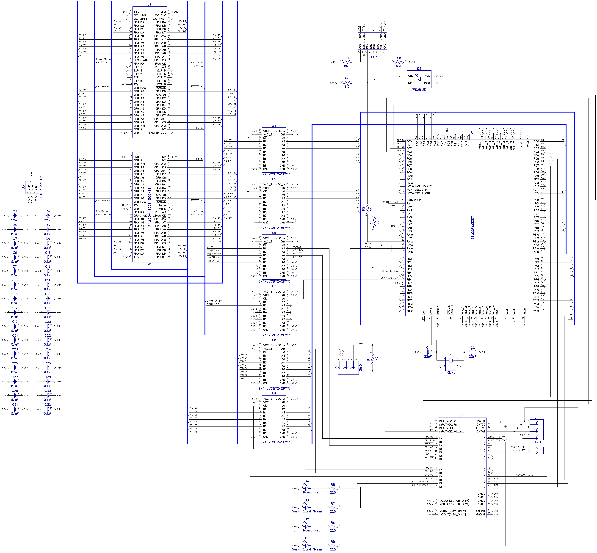

# Famicom Dumper/Writer

## Overview

This is a advanced dumper/writer for Famicom/NES cartridges and Famicom Disc System cards. The goal of the project is to create an ideal famicom data bus simulator. It's using a very accurate M2 cycle simulation and FSMC (Flexible Static Memory Controller) to access PRG and CHR memory. FSMC is precisely synchronized with the M2 clock signal using a CPLD chip. Also, this device is very fast.

You can use it to:

* Dump cartridges, so you can play copy of your cartridge on emulator.
* Read/write battery backed saves, so that you can continue your saved game on emulator/console.
* Write special cartridges like [COOLGIRL](https://github.com/ClusterM/coolgirl-famicom-multicard).
* Rewrite ultracheap chinese COOLBOY cartridges. Soldering is required to work with old versions but it's very simple. New versions can be rewritten without soldering.
* Test your cartridges.
* Read and write Famicom Disk System cards using FDS drive with the RAM adapter.
* Some reverse engineering.
* Anything else that requires Famicom bus simulation.

## Schematic:

Bill of Materials:

## Firmware

You need to write firmware to two chips: the STM32F103ZET microcontroller and the EPM3064 CPLD. But actually you need only to flash bootloader to STM32 using ST-Link programmer. Using bootloader you can flash both firmwares: to the STM32F103ZET and to the EPM3064.

How to use bootloader:
* Disconnect device from USB
* Short the ground and the IRQ pins using tweezers or scissors

* Connect the device to the USB of your PC/Mac, the RGB LED should turn green, try again if it's not green
* Remove tweezers/scissors quickly while the LED is green
* The LED should turn yellow, try again if it's not yellow
* The device should be detected as USB drive
* Format it to FAT32 if it's not formatted yet (you need to do it only once)
* Write SVF file with firmware for EPM3064 and BIN file with firmware for STM32F103ZET to this drive, you can write both at the same time
* The RGB LED should turn white
* Wait for some time (~30 seconds for EPM3064 firmware, ~1 second for STM32F103ZET firmware)
* The RGB LED should turn green if success, red on some error
* Reconnect device to your PC/Mac

## Driver

Under Windows the driver is usually installed automatically. 

## Software

[https://github.com/ClusterM/famicom-dumper-client](https://github.com/ClusterM/famicom-dumper-client)
