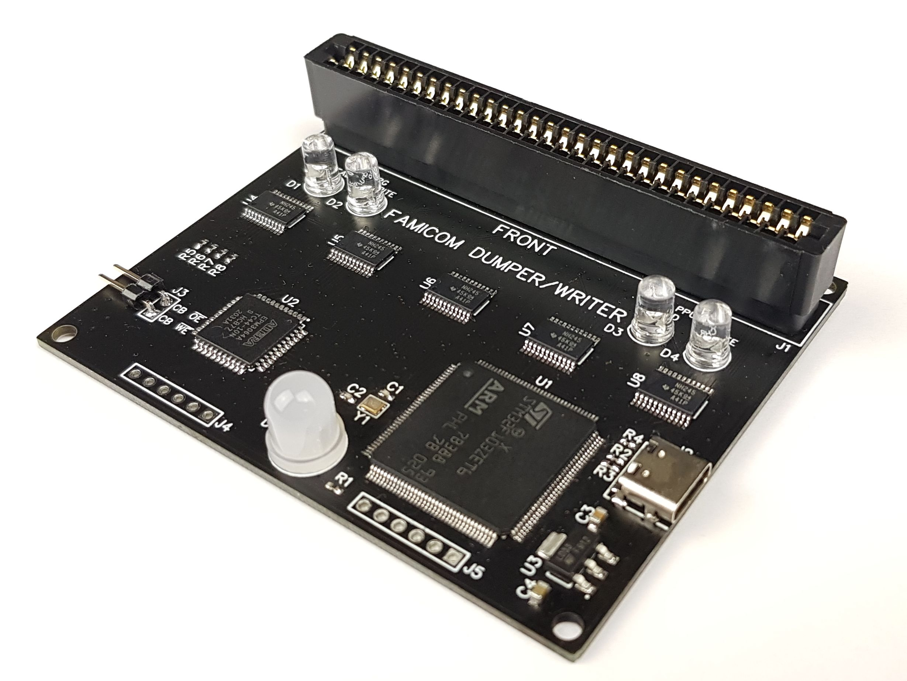

# Famicom Dumper/Writer

## Overview

This is simple dumper/writer for Famicom cartridges and Famicom Disc System cards.

You can use it to:
* Dump cartridges, so you can play copy of your cartridge on emulator
* Read/write battery backed saves, so you can continue your saved game on emulator/console
* Write special cartridges like [COOLGIRL](https://github.com/ClusterM/coolgirl-famicom-multicard)
* Rewrite ultracheap chinese COOLBOY cartridges. Soldering is required for old versions but it's very simple. New versions can be rewrited without soldering
* Test your cartridges
* Read and frite Famicom Disk System cards using FDS drive with RAM adapter
* Some reverse engineering
* Anything else that requires Famicom bus simulation

##Schematic:

Bill of Materials:

## Software

[https://github.com/ClusterM/famicom-dumper-client](https://github.com/ClusterM/famicom-dumper-client)
